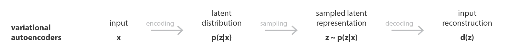

# Vector Quantized Variational Autoencoder

## About: 
### Variational Autoencoder

A Variational Autoencoder (VAE) is a type of generative model that combines neural networks and probabilistic modeling to learn a latent representation of input data and generate new, similar data. Autoencoder whose training is regularised to avoid overfitting and ensure that the latent space has good properties that enable generative process.



#### Encoder:

The encoder maps input data x to a latent space.
Instead of mapping x to a single point in the latent space, it maps x to a distribution, typically a Gaussian with mean μ(x) and standard deviation σ(x).
#### Latent Space:

The latent space is where the compressed representation of the input data resides.
A random sample 𝑧 is drawn from the latent distribution N(μ(x),σ(x)).

#### Decoder:
The decoder maps the sampled latent variable z back to the data space to reconstruct the input data X.
It generates data that resembles the input distribution from the latent variable.
#### Loss Function:

The VAE uses a loss function that combines two terms:
1. Reconstruction Loss: Measures how well the output of the decoder matches the input data. This can be done using Mean Squared Error (MSE) or Binary Cross-Entropy (BCE).
2. KL Divergence: Ensures that the learned latent space distribution is close to a prior distribution (typically a standard normal distribution). It acts as a regularizer to prevent overfitting and ensures a well-structured latent space.

### Vector Quantized VAE

#### Why different from VAE:
    1. Encoder network outputs discrete, rather than continuous, codes.
    2. The prior is learnt rather than static.

#### Posterior Collapse:
Posterior collapse is a phenomenon in VAEs where the encoder output (the posterior distribution) becomes almost identical to the prior distribution, regardless of the input.
This typically happens when the decoder is too powerful, learning to reconstruct the input without relying on the latent code.
As a result, the latent variables z carry little to no useful information, rendering the latent space ineffective.


## Commands:

#### Clone repo
```bash
git clone https://github.com/deepakdhull80/vqvae-pytorch.git
cd vqvae-pytorch
```

#### Training Script
```
usage: train.py [-h] -c CONFIG [-d DEVICE] [-p DATA_PATH] [-b BATCH_SIZE]
                [-n NUM_WORKERS] [-e EPOCHS] [-w WANDB_KEY]

options:
  -h, --help            show this help message and exit
  -c CONFIG, --config CONFIG
  -d DEVICE, --device DEVICE
  -p DATA_PATH, --data-path DATA_PATH
  -b BATCH_SIZE, --batch-size BATCH_SIZE
  -n NUM_WORKERS, --num-worker NUM_WORKERS
  -e EPOCHS, --epochs EPOCHS
  -w WANDB_KEY, --wandb-key WANDB_KEY
```

#### Start single GPU training
Variational AutoEncoder
```bash
python train.py \
    --config vae \
    --device cuda \
    --data-path /kaggle/input/coco-2017-dataset/coco2017/train2017 \
    --epochs 50 \
    --num-worker 4 \
    --batch-size 256
```

Conditional Variational AutoEncoder
```bash
python train.py \
    --config conditional_vae \
    --device cuda \
    --data-path /kaggle/input/coco-2017-dataset/coco2017 \
    --epochs 50 \
    --num-worker 4 \
    --batch-size 256
```

## TODO:
    - [] Generated image push to wandb along with ground truth.
    - [] Add perceptual loss
    - [] Image completion task
    - [] Sketch to Realistic Image Generation

## Completed:
    - [x] Vector Quantized Variational AutoEncoder
    - [x] Code Base is ready to test different architectures
    - [x] Tried Auto Encoder: Able to see decent results only in compressed image generation, but it failed to generate any image from random noise.
    - [x] Generator script created.
    - [x] Variational AutoEncoder
    - [x] Conditional Variation Autoencoder

### References
1. Understanding Variational Autoencoders [Link](https://towardsdatascience.com/understanding-variational-autoencoders-vaes-f70510919f73)
2. Variational Autoencoder Demystified With PyTorch Implementation [Link](https://towardsdatascience.com/variational-autoencoder-demystified-with-pytorch-implementation-3a06bee395ed)
